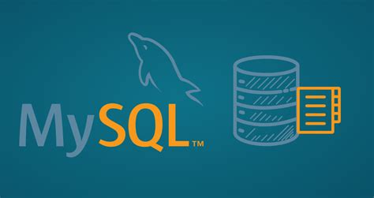
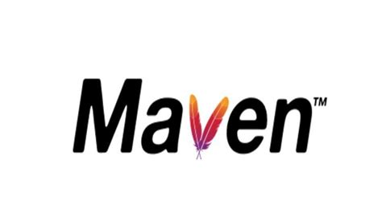

## Corso JAVA Spring
Corso introduttivo Servlet, Sprinboot Rest e Servlet - 5 giorni





## Primi passi
Scaricare la repo per seguire le prime fasi del corso 
```
$ git clone https://github.com/AlessandroS94/corso_21122022.git
$ cd corso_21122022
```

## Technologies
Project is created with:
* Java 17 LTS: 12.3
* Mysql 
* Intellij IDE :IDE
* MAMP :application

## Setup
Eseguire i seguenti setup:
#### Windows
* Installare JDK 17 LTS [https://www.oracle.com/java/technologies/javase/jdk17-archive-downloads.html](https://www.oracle.com/java/technologies/javase/jdk17-archive-downloads.html)
  


* Installare Tomcat [https://tomcat.apache.org/download-10.cgi](https://tomcat.apache.org/download-10.cgi)
  
  Eseguire l' unzip e spostare il contenuto nel workspace del progetto
* Installare maven (Opzionale se si usa Sts o IntelliJ)
Scarica dal seguente link [https://maven.apache.org/download.cgi](https://maven.apache.org/download.cgi)
maven. 
Seguire i seguenti step:


```
$ mvn -version
```
### Macos
Utilizzare homebrew
* Installare JDK 17 LTS 
```
$ brew install openjdk@17
$ echo 'export PATH="/usr/local/opt/openjdk@17/bin:$PATH"' >> ~/.zshrc
$ export CPPFLAGS="-I/usr/local/opt/openjdk@17/include"  
$ javac -version
(controllo della visibilità)
```

* Installare Tomcat [https://tomcat.apache.org/download-10.cgi](https://tomcat.apache.org/download-10.cgi)
  
  Eseguire l' unzip e spostare il contenuto nel workspace del progetto

* Installare maven (Opzionale se si usa Sts o IntelliJ)
```
$ brew install maven
```
### Linux (debian)
Seguire i seguenti comandi
```
$ sudo su -
$ wget https://download.oracle.com/java/17/latest/jdk-17_linux-x64_bin.rpm
$ rpm -ivh jdk-17_linux-x64_bin.rpm
$ sudo apt update
$ sudo apt install -y libc6-x32 libc6-i386
$ wget https://download.oracle.com/java/17/latest/jdk-17_linux-x64_bin.deb
$ sudo dpkg -i jdk-17_linux-x64_bin.deb
$ java -version
```
#### Linux Ubuntu
```
$ apt install openjdk-17-jdk openjdk-17-jre
```


* Installare Tomcat [https://tomcat.apache.org/download-10.cgi](https://tomcat.apache.org/download-10.cgi)
  
  Eseguire l' unzip e spostare il contenuto nel workspace del progetto

* Installare maven (Opzionale se si usa Sts o IntelliJ)
```
$ sudo apt install install maven
```