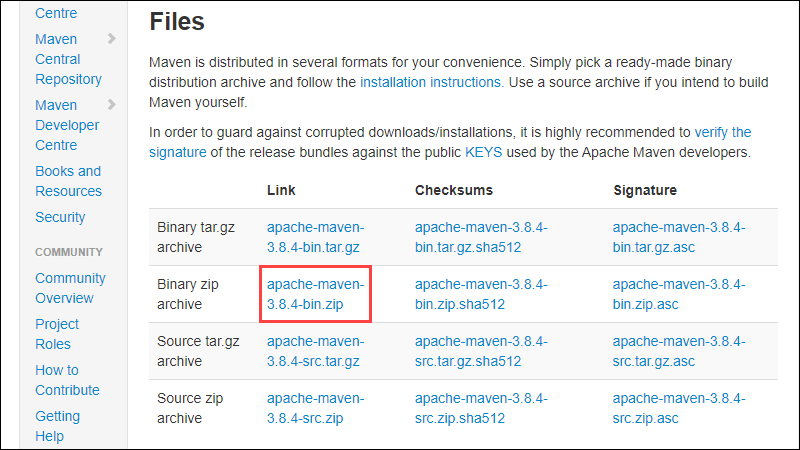

## Corso JAVA JEE / Spring
### Day 1 - 2 - 3 --> JEE
Corso introduttivo Servlet, Sprinboot Rest e Servlet - 10 giorni


## Primi passi
Scaricare la repo per seguire le prime fasi del corso 
```
$ git clone https://github.com/AlessandroS94/corso_21122022.git
$ cd corso_21122022
```

## Technologies
Project is created with:
* Java 17 LTS 
* Mysql 
* Intellij IDE : IDE
* MAMP :application

## Setup
Eseguire i seguenti setup:
#### Windows
* Installare JDK 17 LTS [https://www.oracle.com/java/technologies/javase/jdk17-archive-downloads.html](https://www.oracle.com/java/technologies/javase/jdk17-archive-downloads.html)
  
  *.* Verifica che la JDK sia stata installata correttamente: vai alla cartella in cui hai installato la JDK (ad esempio, "C:\Program Files\Java\jdk1...") e controlla che la cartella esista e che contenga le sottocartelle "bin", "jre", "lib", ecc.

  Imposta la variabile d'ambiente JAVA_HOME:
  Apri il Pannello di controllo di Windows e vai su Sistema > Impostazioni avanzate di sistema > Variabili d'ambiente.
  Nella sezione "Variabili sistema", cerca la variabile "JAVA_HOME" e selezionala.
  Clicca sul pulsante "Modifica" e inserisci il percorso della cartella di installazione della JDK (ad esempio, "C:\Program Files\Java\jdk1....") come valore della variabile.
  Clicca su OK per salvare le modifiche.

  Aggiorna la variabile PATH: per aggiungere il percorso della cartella "bin" della JDK alla variabile PATH, cerca la variabile PATH nella sezione "Variabili sistema" delle impostazioni delle variabili d'ambiente e selezionala. Clicca sul pulsante "Modifica" e aggiungi il percorso della cartella "bin" della JDK (ad esempio, "%JAVA_HOME%\bin") alla fine del valore esistente della variabile. Clicca su OK per salvare le modifiche.

  Riavvia il prompt dei comandi: dopo aver apportato modifiche alle variabili d'ambiente, è necessario riavviare il prompt dei comandi per rendere effettive le modifiche.

* Installare Tomcat [https://tomcat.apache.org/download-10.cgi](https://tomcat.apache.org/download-10.cgi)
  
  Eseguire l' unzip e spostare il contenuto nel workspace del progetto
* Installare maven (Opzionale se si usa Sts o IntelliJ)
Scarica dal seguente link [https://maven.apache.org/download.cgi](https://maven.apache.org/download.cgi)
maven. 
Seguire i seguenti step:



```
$ mvn -version
```
### Macos
Utilizzare homebrew
* Installare JDK 17 LTS 
```
$ brew install openjdk@17
$ echo 'export PATH="/usr/local/opt/openjdk@17/bin:$PATH"' >> ~/.zshrc
$ export CPPFLAGS="-I/usr/local/opt/openjdk@17/include"  
$ javac -version
(controllo della visibilità)
```

* Installare Tomcat [https://tomcat.apache.org/download-10.cgi](https://tomcat.apache.org/download-10.cgi)
  
  Eseguire l' unzip e spostare il contenuto nel workspace del progetto

* Installare maven (Opzionale se si usa Sts o IntelliJ)
```
$ brew install maven
```
### Linux (debian)
Seguire i seguenti comandi
```
$ sudo su -
$ wget https://download.oracle.com/java/17/latest/jdk-17_linux-x64_bin.rpm
$ rpm -ivh jdk-17_linux-x64_bin.rpm
$ sudo apt update
$ sudo apt install -y libc6-x32 libc6-i386
$ wget https://download.oracle.com/java/17/latest/jdk-17_linux-x64_bin.deb
$ sudo dpkg -i jdk-17_linux-x64_bin.deb
$ java -version
```
#### Linux Ubuntu
```
$ apt install openjdk-17-jdk openjdk-17-jre
```


* Installare Tomcat [https://tomcat.apache.org/download-10.cgi](https://tomcat.apache.org/download-10.cgi)
  
  Eseguire l' unzip e spostare il contenuto nel workspace del progetto

* Installare maven (Opzionale se si usa Sts o IntelliJ)
```
$ sudo apt install install maven
```

## Springboot 
 I requisiti precedenti sono più che sufficienti l'installazione di Tomcat per questa parte di corso non è necessaria sono sufficienti Java 17 (openjdk) e Mamp/Lamp/mysql workbench per l'esecuzione del server mysql.
Inoltre i progetti sono settatti con le credenziali diemme come username, password come password e come porta la 8888; in caso di problemi sostituirla con la <b> 3306 </b>  se state utilizzando altri server alternativi a Mamp.


